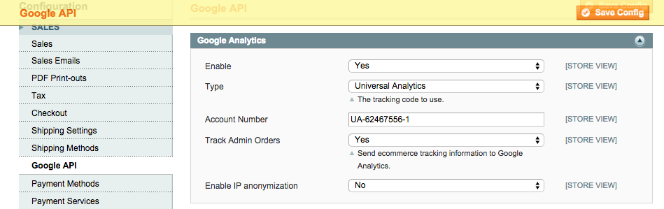

Admin Order Analytics
=====================

Send ecommerce tracking information to Google Analytics for orders created
in the Magento admin.

Description
-----------
Create an order in the admin and the order and items information will be sent 
to Google Analytics. In the Analytics admin, you can view order information in 
the ECommerce tab on the left hand side.

How to use
----------
Upload the files to your website. In the System -> Configuration -> Sales ->
Google API, set Track Admin Orders to Yes:

